# 👔 WorkOps - HR Management System Frontend

A comprehensive Human Resources management system designed to streamline employee administration, visualize organizational structure, and foster company culture through social features.

   

## 📋 Table of Contents
- [Overview](#-overview)
- [Screenshots](#-screenshots)
- [Features](#-features)
- [Tech Stack](#-tech-stack)
- [Getting Started](#-getting-started)
- [Project Structure](#-project-structure)
- [Configuration](#️-configuration)
- [Backend](#-backend)
- [License](#-license)
- [Author](#-author)

## 🌟 Overview
WorkOps is a modern web application that transforms standard HR tasks into an interactive and data-driven experience. It combines traditional employee management with social recognition features and powerful analytics.

**Key Capabilities:**
- 👥 **Comprehensive Employee Profiles**: Manage personal details, emergency contacts, documents, and notes.
- 📊 **Interactive Dashboard**: Real-time data visualization for headcount, salary trends, and department breakdowns.
- ❤️ **Social Recognition**: "Give Thanks" feed to foster company culture with likes and comments.
- ⚙️ **Admin Control**: Granular permission settings for dashboard visibility, menu access, and system defaults.
- 📅 **Time Management**: Robust Time Entry and Time Off request systems with approval workflows.
- 🌴 **Holiday Management**: Configurable company holidays and calendar integration.
- 📱 **Responsive Design**: Fully responsive interface built with Material-UI.

## 📸 Screenshots

### Dashboard
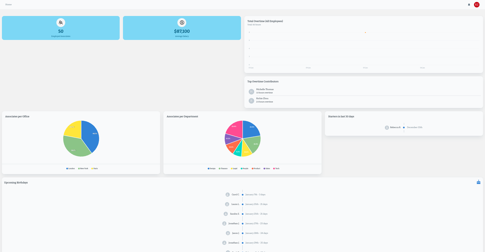

### Associates & Profile
| All Associates | Associate Profile |
|:---:|:---:|
| 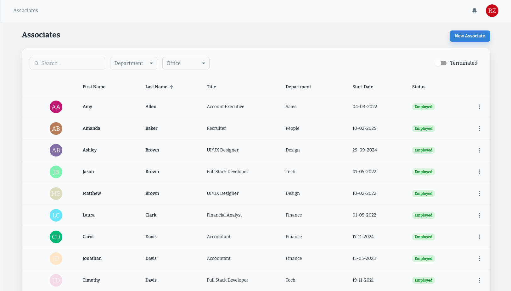 | 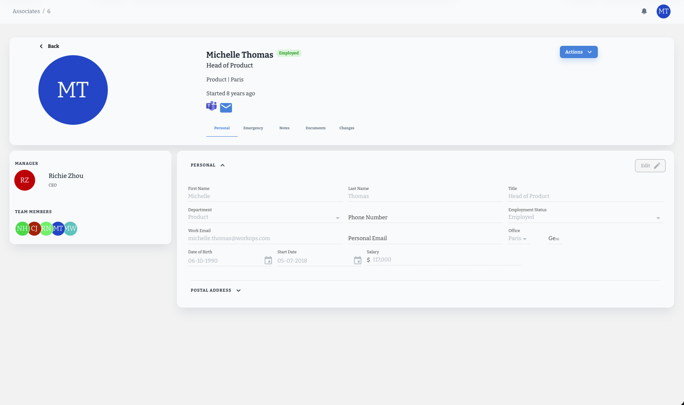 |

| New Associate |
|:---:|
| 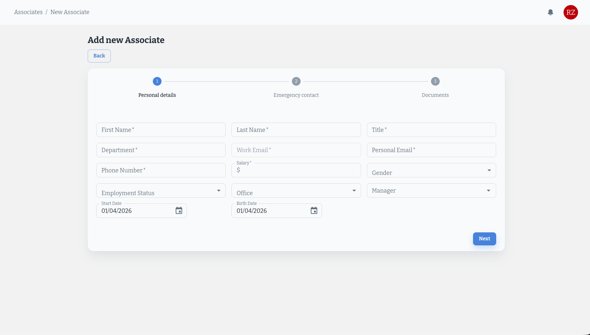 |

### Time Management
| Time Entry | Time Off Requests |
|:---:|:---:|
| 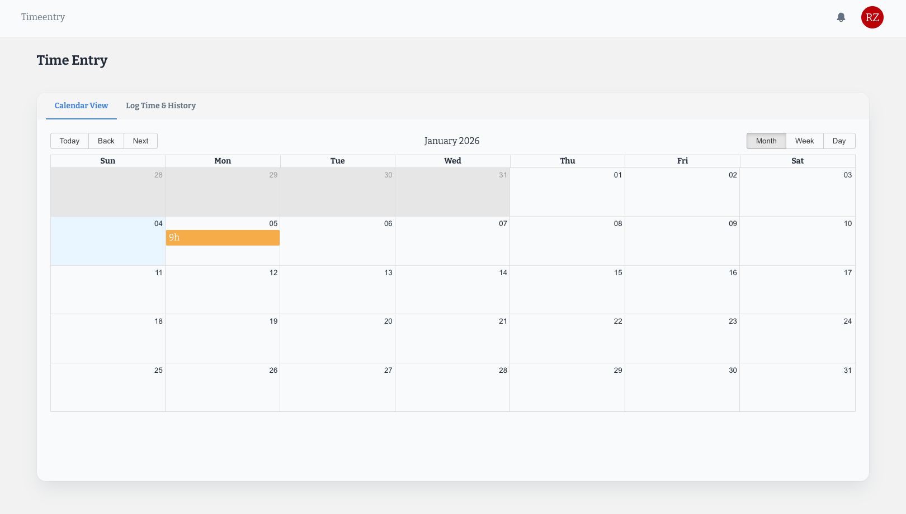 | 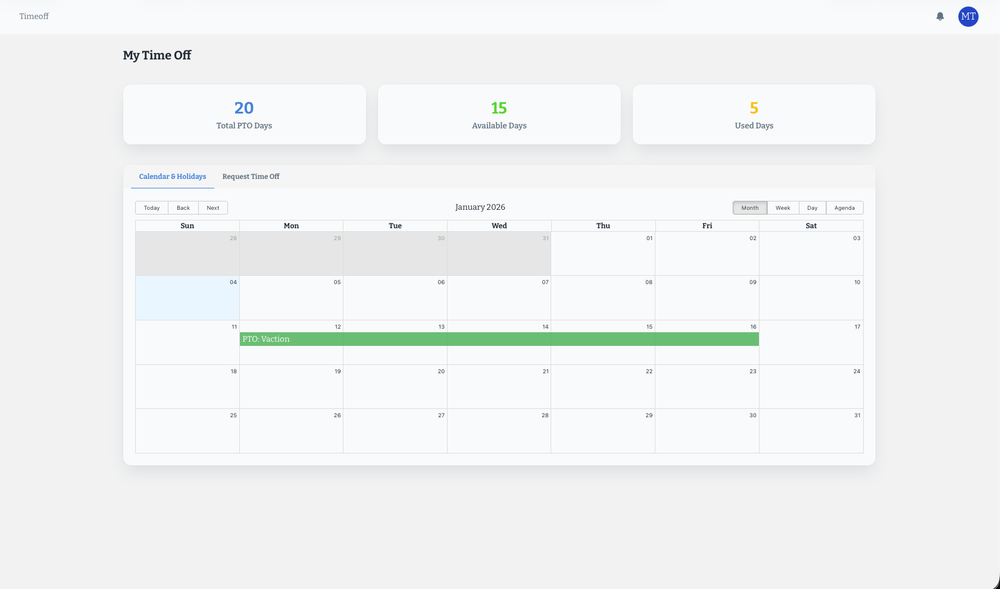 |

### Approvals Workflows
| Time Entry Approvals | Time Off Approvals |
|:---:|:---:|
| 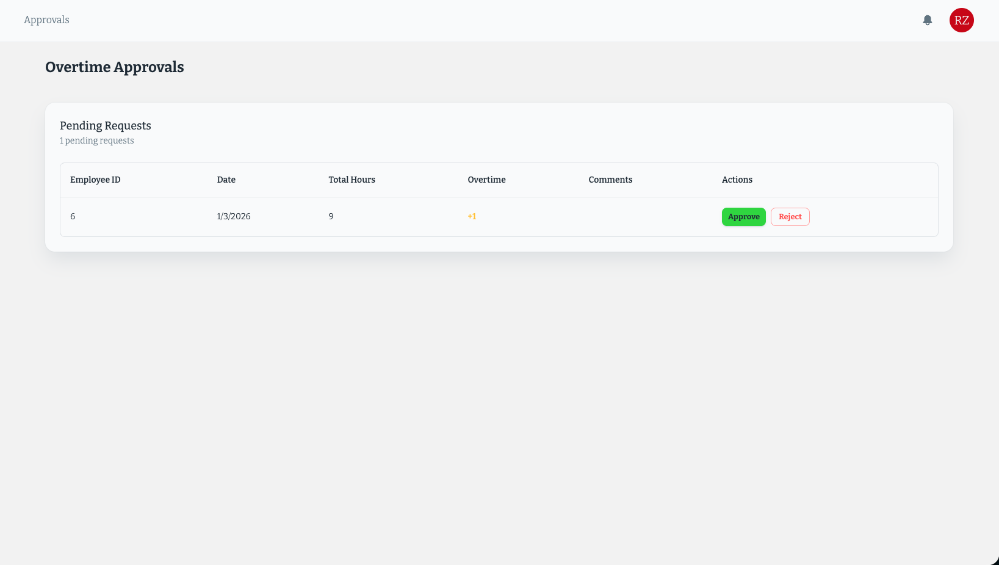 | 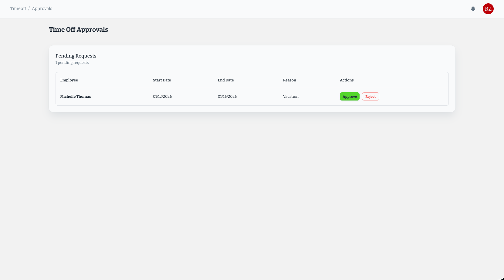 |

### Org Structure & Team
| Hierarchy | My Team |
|:---:|:---:|
| 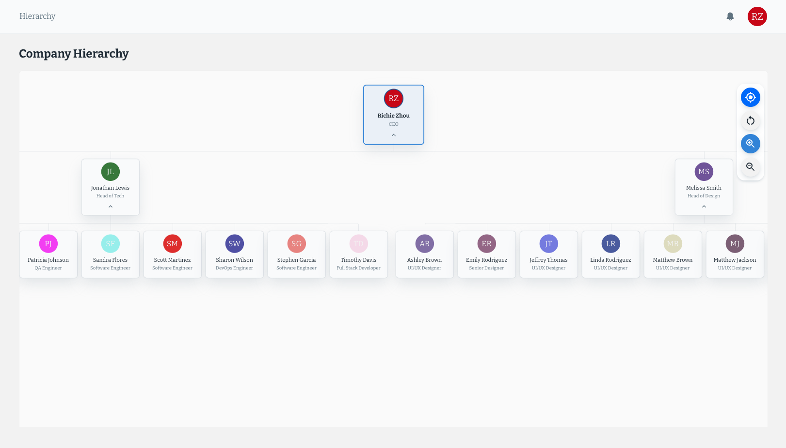 | 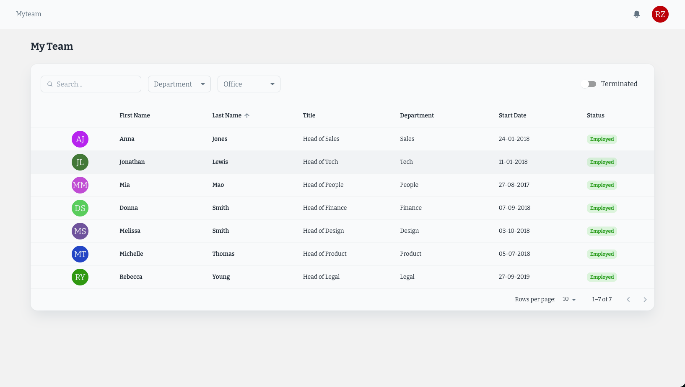 |

### Culture & Recognition
| All Thanks | Give Thanks |
|:---:|:---:|
| 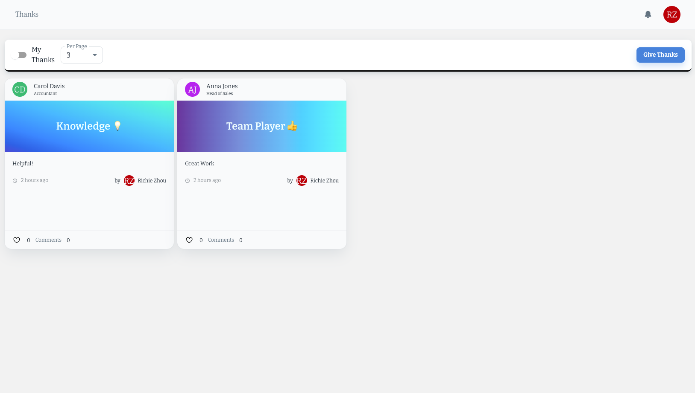 | 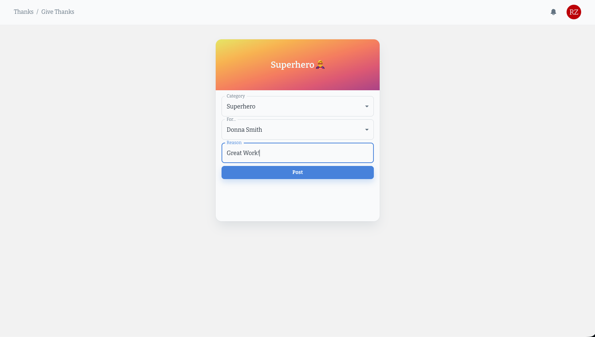 |

### Administration
| Admin Dashboard | Task Management |
|:---:|:---:|
| 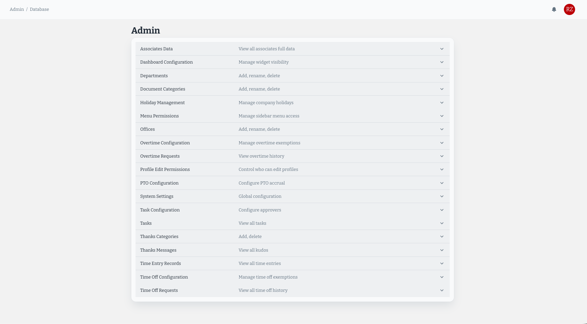 | 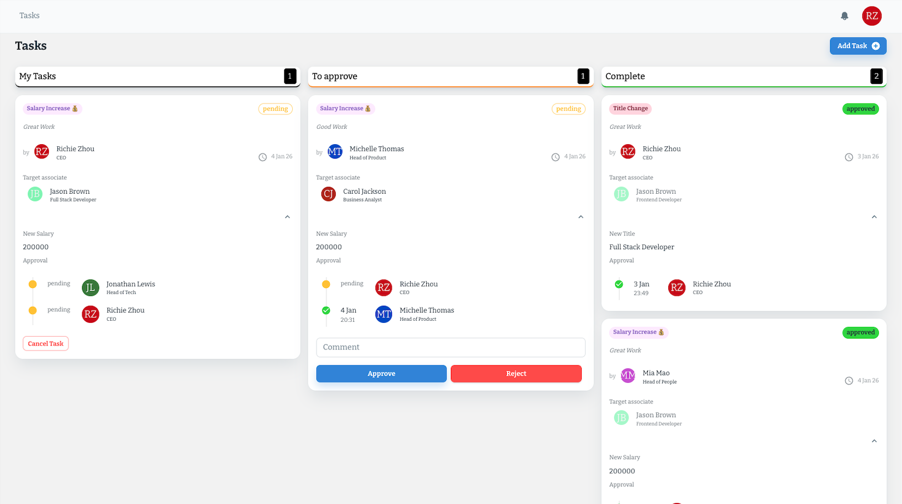 |

## ✨ Features

### 🔐 Authentication & Security
- Secure login and registration system.
- Password management (Change Password, Forgot Password flows).
- Automated user account creation for new employees.
- Role-based access control (Admin vs Standard User).
- Detailed Menu Permission system to control sidebar visibility by Title or Department.

### 🏠 Home Dashboard
- **Headcount Metrics**: Total employed, active vs terminated.
- **Financial Analytics**: Average salary tracking and history.
- **Visual Graphs**: Department and Office distribution charts.
- **Timelines**: Upcoming birthdays and work anniversaries.
- **Configurable Widgets**: Admin-controlled visibility for sensitive widgets.

### 👥 Associate Management
- **Profile Management**: Upload profile pictures, manage contact info.
- **Document Repository**: Upload and categorize associate documents.
- **Org Chart**: Visual hierarchy and "My Team" views.
- **Status Tracking**: Active/Terminated status management.

### 📅 Time & Attendance
- **Time Entry**: Employees can log hours with overtime calculation.
- **Time Off**: PTO requests with balance tracking.
- **Holiday Management**: Admin-managed company holidays appear on calendars.
- **Approvals**: Dedicated approval interfaces for Managers, Head of Departments, and CEO.

### ❤️ Social & Culture
- **Give Thanks Feed**: Public recognition board.
- **Interactions**: Like and comment on recognition posts.
- **Notifications**: Alerts for new interactions and system events.

### ⚙️ Automation & Admin
- **Approval Workflows**: Tasks for salary increases and title promotions.
- **System Settings**: Configurable default passwords and categories.
- **Permission Management**: Control widget and menu visibility.
- **Database Management**: Add/Edit Offices, Departments, and other metadata.

## 🛠 Tech Stack

### Core Framework
- **React 17** - UI library
- **Vite** - Build tool
- **React Router v6** - Client-side routing

### State Management & Data
- **Context API** - Global state (Auth, Associates, Notifications)
- **Local Storage** - Session persistence

### UI Components & Styling
- **Material-UI (MUI)** - Enterprise-grade UI component library
- **MUI Icons** - Iconography
- **Framer Motion** - Animations and transitions

### Data Visualization
- **Recharts** - Composable charting library
- **React ApexCharts** - Interactive visualizations
- **React Big Calendar** - Calendar views for Time Off

### Tools & Utilities
- **Formik & Yup** - Form handling and validation
- **Moment.js / Date-fns** - Date manipulation
- **React Dropzone** - File uploads

## 🚀 Getting Started

### Prerequisites
- Node.js (v14 or higher)
- Docker & Docker Compose (for full stack)
- Go 1.21+ (if running backend locally without Docker)

### Installation

1. **Clone the repository**
   ```bash
   git clone <repository-url>
   ```

2. **Start the Backend (Required)**
   The frontend requires the backend API to be running.
   ```bash
   # From the root directory
   docker compose up --build -d api
   ```
   *The backend will start on `http://localhost:8081`*

3. **Install Frontend Dependencies**
   ```bash
   cd frontend
   npm install
   ```

4. **Start the Frontend Development Server**
   ```bash
   npm start
   ```

5. **Open Your Browser**
   Navigate to `http://localhost:3000`

### Quick Start (Full Stack)
To start everything (Frontend + Backend + DB) with one command:
```bash
docker compose up --build
```

## 📁 Project Structure

```
frontend/
├── public/                 # Static assets (images, favicon)
├── src/
│   ├── assets/             # Images and demo screenshots
│   ├── components/         # Reusable UI components
│   │   ├── Associate/      # Associate-related components
│   │   ├── Graphs/         # Dashboard charts
│   │   ├── Tasks/          # Approval task components
│   │   └── Thanks/         # Social feed components
│   ├── layouts/            # Page layouts (Dashboard, LogoOnly)
│   ├── pages/              # Main page views
│   │   ├── Admin/          # System configuration
│   │   ├── Approvals/      # Time Entry & Time Off Approvals
│   │   ├── Home/           # Dashboard
│   │   ├── Login/          # Auth pages
│   │   ├── MyTeam/         # Team views
│   │   └── TimeOff/        # Time Off management
│   ├── utils/              # Utilities and Helpers
│   │   └── context/        # React Context definitions
│   ├── routes.js           # Route definitions
│   ├── theme/              # MUI Theme configuration
│   └── App.js              # Root component
├── package.json            # Dependencies
└── README.md               # This file
```

## ⚙️ Configuration

### API Endpoint
The frontend connects to the Go backend. By default, it expects the backend at `http://localhost:8081`.
Admin configuration features (Dashboard visibility, Default passwords, Menu permissions) are available in the **Admin** tab of the application.

## 🔗 Backend

- **Backend API**: [WorkOps API](https://github.com/arunike/WorkOps-API)

## 📄 License

This project is licensed under the MIT License - see the [LICENSE](LICENSE.txt) file for details.

## 👤 Author

**Richie Zhou**

- GitHub: [@arunike](https://github.com/arunike)

